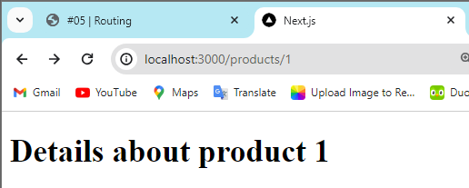

## Laporan Praktikum

|  | Pemrograman Berbasis Framework 2024 |
|--|--|
| NIM |  2141720167|
| Nama |  Evan Fadhilah Dzulfikar |
| Kelas | TI - 3I |

### Practicum 1

 

### Practicum 2

"Question: What are the possible drawbacks of using the approach in Practicum 2 to handle routing?"

    The disadvantages is that we need to add the routing one by one ourself. It will take time to make the routing.

 

### Practicum 3

"To do 1 : Improve the implementation of Practicum 2 using Dynamic Routes"

 

"To do 2 : Using the concepts of Nested Routes and Dynamic Routes, create a page with the routing /products/[productId]/reviews/[reviewId]."

 

### Practicum 4

 